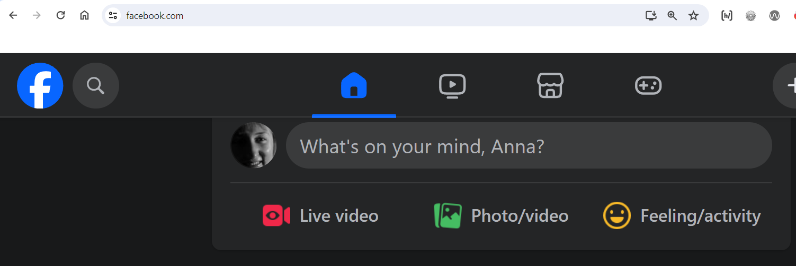
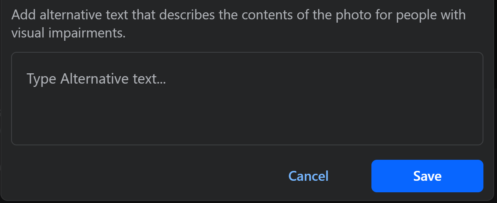

# User Guide: Adding a Photo on Facebook

This user manual offers a clear and concise comparison of the steps for adding a photo on Facebook across different devices.

### Table of contents
- [Mobile browser](#If-you-access-Facebook-in-mobile-web-browser)
- [Android app](#If-you-use-the-Facebook-Android-app)
- [iOS app](#If-you-use-the_iOS-app)
- [Laptop](#If-you-use-Facebook-on-the-laptop)
- [Table](#table)

"What's on your mind?" box at the top of Facebook timeline.

---

## Mobile browser
If you access Facebook in the mobile web browser

**Step 1: Log in to Facebook**

- Open your mobile web browser and go to [www.facebook.com](https://www.facebook.com/).
- Enter your login credentials and tap "Log In".

**Step 2: Access Your Profile**

- Tap the three horizontal lines in the top-right corner.
- Select your profile to navigate to your page.

**Step 3: Create a New Post**

- Locate and tap the "What's on your mind?" box at the top of your timeline.

**Step 4: Add a Photo**

- Tap the camera icon to add a photo.
- Select "Choose from Gallery" to pick an existing photo or "Take Photo" to capture a new one.

**Step 5: Write a Caption**

- Add a caption to describe your photo.

**Step 6: Post Your Photo**

- Tap "Post" to share your photo with your Facebook friends.

**Step 7: Add ALT Tag for Accessibility**

- After posting, navigate to your photo, tap the three dots, and select "Edit Photo."
- Add a descriptive ALT tag in the "Alternative Text" field.
- Save your changes.

---

## Facebook Android app
If you use the Facebook Android application

**Step 1: Log in to Facebook**

- Open the Facebook app.
- Enter your login credentials and tap "Log In".

**Step 2: Access Your Profile**

- Tap the three horizontal lines in the top-right corner.
- Select your profile to navigate to your page.

**Step 3: Create a New Post**

- Locate and tap the "What's on your mind?" box at the top of your timeline.

**Step 4: Add a Photo**

- Tap the camera icon to add a photo.
- Select "Choose from Gallery" to pick an existing photo or "Take Photo" to capture a new one.

**Step 5: Write a Caption**

- Add a caption to describe your photo.

**Step 6: Post Your Photo**

- Tap "Post" to share your photo.

**Step 7: Add ALT Tag for Accessibility**

- After posting, locate your photo, tap the three dots, and select "Edit Photo."
- Add a descriptive ALT tag in the "Alternative Text" field.
- Save your changes.

---

## Facebook iOS app
If you use the Facebook iOS application

**Step 1: Log in to Facebook**

- Open the Facebook app.
- Enter your login credentials and tap "Log In".

**Step 2: Access Your Profile**

- Tap the three horizontal lines in the top-right corner.
- Select your profile to navigate to your page.

**Step 3: Create a New Post**

- Locate and tap the "What's on your mind?" box at the top of your timeline.

**Step 4: Add a Photo**

- Tap the camera icon to add a photo.
- Select "Choose from Gallery" to pick an existing photo or "Take Photo" to capture a new one.

**Step 5: Write a Caption**

- Add a caption to describe your photo.

**Step 6: Post Your Photo**

- Tap "Post" to share your photo.

**Step 7: Add ALT Tag for Accessibility**

- After posting, find your photo, tap the three dots, and select "Edit Photo."
- Add a descriptive ALT tag in the "Alt Text" field.
- Save your changes.

---

## Laptop
## If you use Facebook on the laptop

**Step 1: Log in to Facebook**

- Open your web browser and visit [www.facebook.com](https://www.facebook.com/).
- Enter your login credentials and click "Log In".

**Step 2: Access Your Profile**

- Click on your profile picture to go to your timeline.

**Step 3: Create a New Post**

- Locate the "What's on your mind?" box at the top of your timeline.

**Step 4: Add a Photo**

- Click the camera icon to upload a photo.
- Choose a photo from your computer.

**Step 5: Write a Caption**

- Add a caption to describe your photo.

**Step 6: Post Your Photo**

- Click "Post" to share your photo.

**Step 7: Add ALT Tag for Accessibility**

- After posting, click on your photo, select "Options," and then "Edit Photo."
- Add a descriptive ALT tag in the "Alt Text" field.
- Save your changes.

Type alternative text to add a meaningful description to your photo for assistive technologies.

---

## Table

| Steps | Mobile Web | Android App | iPhone App (iOS) | Laptop |
| --- | --- | --- | --- | --- |
| 1. Log in to Facebook | Open browser, go to https://www.facebook.com/, enter login credentials, tap "Log In" | Open the Facebook app, log in | Open the Facebook app, log in | Open browser, go to https://www.facebook.com/, enter login credentials, click "Log In" |
| 2. Access Your Profile | Tap three lines, select profile | Tap three lines, select profile | Tap three lines, select profile | Click on profile picture |
| 3. Create a New Post | Tap "What's on your mind?" | Tap "What's on your mind?" | Tap "What's on your mind?" | Locate "What's on your mind?" box |
| 4. Add a Photo | Tap camera icon, choose from gallery or take photo | Tap camera icon, choose from gallery or take photo | Tap camera icon, choose from gallery or take photo | Click camera icon, upload photo |
| 5. Write a Caption | Add a caption | Add a caption | Add a caption | Add a caption |
| 6. Post Your Photo | Tap "Post" | Tap "Post" | Tap "Post" | Click "Post" |
| 7. Add ALT Tag for Accessibility | After posting, find photo, tap three dots, select "Edit Photo," add ALT tag in "Alternative Text," save | After posting, find photo, tap three dots, select "Edit Photo," add ALT tag in "Alternative Text," save | After posting, find photo, tap three dots, select "Edit Photo," add ALT tag in "Alt Text," save | After posting, click on photo, select "Options," then "Edit Photo," add ALT tag in "Alt Text," save |

---
<aside>
✅ Congratulations! You have successfully added a photo to your Facebook wall. Your new post is now visible to your friends and followers.
</aside>

---

<aside>
💡 If you have followed the accessibility step #7, your content is also accessible to individuals who use assistive technologies.
</aside>
